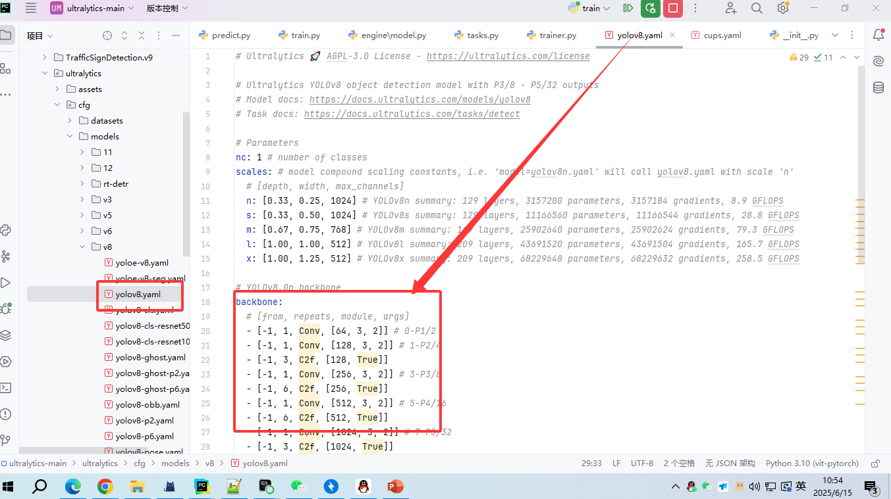
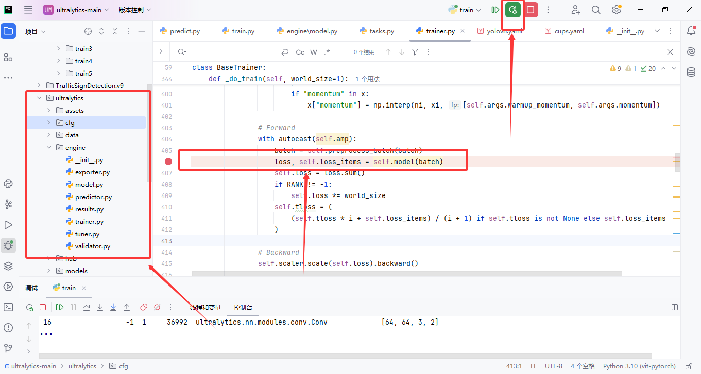
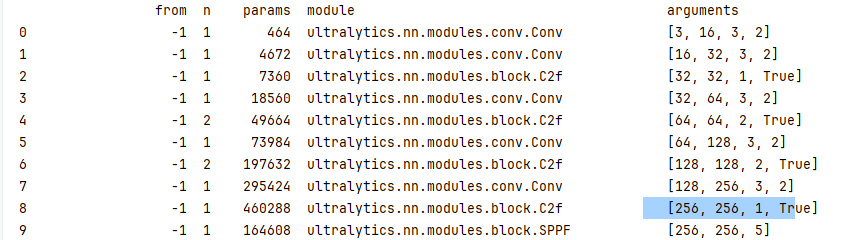
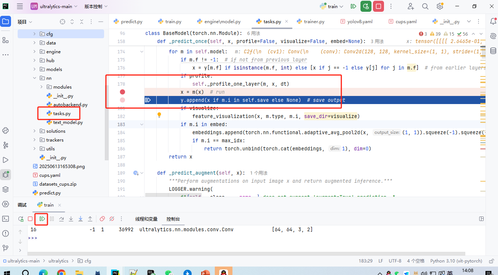

# 绘制yolo算法流程图
打开yolo流程图


根据我们的yaml配置文件绘制yolo流程图


先在06行打断点
调试之后得到我们的模块细节


运行到trainer.py之后在开始打task.py断点


# YOLOv8 与 YOLOv12 算法流程图核心区别分析

## 一、模块结构差异
| **模块类型**       | **YOLOv8 (图1)**                          | **YOLOv12 (图2)**                          |
|--------------------|------------------------------------------|-------------------------------------------|
| **基础模块**       | C2f (如`c2f 64,64,2,True`)               | C3K2 (如`C3K2 32,64,1,False,0.25`)        |
| **上下文模块**     | SPPF (空间金字塔池化)                    | 未显式标注                                |
| **上采样操作**     | 单次上采样后拼接浅层特征                 | 多层嵌套上采样（如160x160→80x80→40x40）   |
| **特征融合方式**   | 简单通道拼接 (`Concat`)                  | 带参数化融合 (`Concat`含通道缩放因子0.25) |

---

## 二、检测头设计对比
| **特性**           | **YOLOv8**                               | **YOLOv12**                               |
|--------------------|------------------------------------------|-------------------------------------------|
| **检测层级**       | 三级：80x80, 40x40, 20x20                | **四级**：新增160x160层                   |
| **输入通道**       | 固定值（64/128/256）                     | 动态压缩（如0.25通道缩放）                |
| **层级深度**       | 浅层特征保留不足                         | 深层网络保留更多细节                     |

---

## 三、参数配置差异
| **参数类型**       | YOLOv8                              | YOLOv12                             |
|--------------------|-------------------------------------|--------------------------------------|
| **激活函数**       | 隐式使用（未标注）                  | 显式标注（如`mish`）                 |
| **通道压缩**       | 无缩放参数                          | `0.25`等缩放因子（如C3K2模块）       |
| **卷积标注**       | 简化格式 (`conv 3,16,3,2`)          | 含详细配置 (`128,128,2,True,4`)      |

---

## 四、结构可视化对比
```mermaid
graph LR
    subgraph YOLOv8
    A[640x640] --> B[C2f模块] --> C[SPPF] --> D[单次上采样] --> E[三级检测头]
    end
    
    subgraph YOLOv12
    F[640x640] --> G[C3K2模块] --> H[多层上采样] --> I[四级检测头]
    G -.-> |0.25缩放| J[动态特征压缩]
    end